# Partie 1 : Création de l'application web

## Description
Dans cette première phase du projet DevOps, nous avons créé une application web de gestion des utilisateurs.

## Fonctionnalités
- **API Utilisateur** : L'application offre une API RESTful permettant de créer, lire, mettre à jour et supprimer (CRUD) des utilisateurs.
- **Base de données Redis** : Les données sont stockées dans une base de données Redis, choisie pour sa performance en tant que magasin de structure de données en mémoire.
- **Tests** : L'application inclut des tests unitaires, des tests d'API, des tests de configuration et de connexion pour assurer la qualité et la robustesse du code.
- **Health Check** : Un endpoint de vérification de l'état est mis en place pour s'assurer que l'application fonctionne correctement.

## Installation et Configuration

### Prérequis
- Avoir Node.js et npm installés sur votre machine.
- Avoir une instance de Redis en cours d'exécution et accessible par l'application.

### Installation des dépendances
Pour installer toutes les dépendances nécessaires, exécutez la commande suivante :
```bash
npm install
```
### Lancement de l'application en mode de développement
Pour démarrer l'application en mode de développement avec nodemon (qui redémarrera le serveur automatiquement à chaque fois que vous modifiez un fichier source), utilisez :
```bash
npm run dev
```

### Exécution des tests
Pour exécuter les tests définis avec Mocha, utilisez :
```bash
npm test
```

# Partie 2 : Application du pipeline CI/CD

## Aperçu
Un pipeline d'intégration et de livraison continues (CI/CD) a été configuré et appliqué en utilisant GitHub Actions. Ce pipeline automatise les tests et le déploiement de notre application web sur Microsoft Azure App Service.

## Configuration du Pipeline CI/CD

- **GitHub Actions**: Un workflow de CI/CD a été mis en place dans le répertoire GitHub du projet pour automatiser les tests et le déploiement.
- **Tests Automatisés**: Les tests sont exécutés automatiquement à chaque push ou pull request pour garantir la non-régression du code.
- **Déploiement Automatique**: Après un succès des tests, le déploiement est effectué automatiquement vers Azure App Service.

## Déploiement sur Azure

L'application est déployée sur Azure App Service, offrant une plate-forme PaaS pour héberger des applications web :

- **URL de l'Application**: [my-devops-project.azurewebsites.net](http://my-devops-project.azurewebsites.net)
- **Environnement**: Configuré pour un environnement Linux avec Node.js 18 LTS.

## Instructions de Déploiement

Pour voir le déploiement en action ou pour déclencher un déploiement manuel, suivez ces étapes :

1. Connectez-vous à votre compte GitHub.
2. Naviguez vers le répertoire du projet sur GitHub.
3. Allez dans l'onglet 'Actions'.
4. Sélectionnez le workflow souhaité.
5. Cliquez sur 'Run workflow' pour déclencher le processus manuellement.

## Capture d'écran
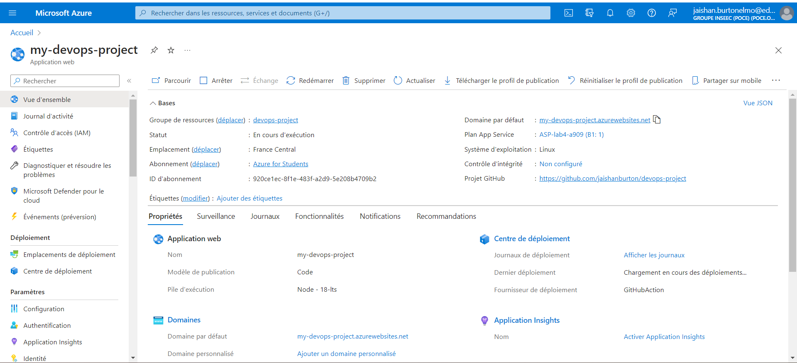

# Partie 3 : Configuration et Provisionnement avec IaC

## Description
Cette partie du projet se concentre sur l'utilisation de Vagrant et Ansible pour configurer et provisionner une machine virtuelle (VM) sous Linux. Cela facilite la création d'un environnement de développement reproductible et la gestion de la configuration de l'application.

## Fonctionnalités
- **Vagrant** : Utilisé pour créer et configurer des environnements de développement légers, reproductibles et portables.
- **Ansible** : Employé pour le provisionnement automatique de la VM, incluant l'installation de l'environnement d'exécution du langage, de la base de données et de l'application.
- **Synchronisation de Dossiers** : Permet de partager facilement des fichiers entre l'hôte et la VM.
- **Health Check** : Configuration d'un point de terminaison pour vérifier l'état de santé de l'application afin d'assurer une surveillance continue.

## Installation et Configuration

### Prérequis
- Installer Vagrant et VirtualBox sur la machine.
- Installer Ansible pour le provisionnement automatique.

### Mise en Place de la VM avec Vagrant
Cloner le dépôt du projet et naviguer vers le sous-dossier `iac/`, puis initialiser et démarrer la VM avec la commande suivante :
```bash
vagrant up
```

### Provisionnement avec Ansible
Après le démarrage de la VM, lancer le provisionnement avec :
```bash
vagrant provision
```

### Connexion à la VM
Pour se connecter à la VM avec SSH et vérifier que tout est correctement configuré :
```bash
vagrant ssh
```

## Utilisation
Utiliser la VM provisionnée pour développer et tester l'application dans un environnement qui reflète la production, et profiter des dossiers synchronisés pour un développement facile.

## Test du Bilan de Santé de l'Application
Tester le point de terminaison de health check après le déploiement de l'application pour confirmer son bon fonctionnement :
```bash
curl http://localhost:PORT/health
```

## Nettoyage
Pour arrêter et supprimer la VM :
```bash
vagrant halt   # Pour arrêter la VM
vagrant destroy # Pour supprimer la VM et toutes ses ressources
```

## Captures d'écran
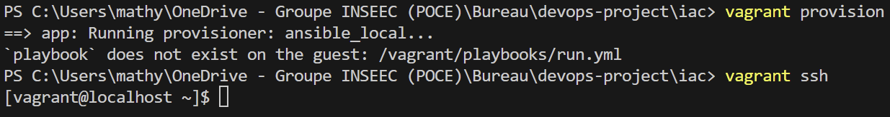

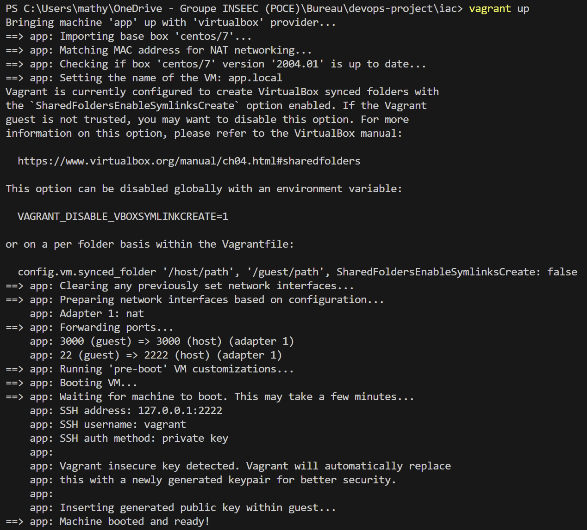

# Partie 4 : Conteneurisation avec Docker

## Création de l'image Docker
Pour conteneuriser l'application, les étapes suivantes ont été suivies :

1. Création d'un fichier `Dockerfile` à la racine du projet pour définir les étapes de construction de l'image Docker de l'application.

2. Construction de l'image Docker avec la commande :
```bash
docker build -t jaishan23/myproject:<tag> .
```

3. Vérifier l'image : Après la construction, il faut vérifier que l'image a été créée avec succès :
 ```bash
docker images
```
## Téléversement de l'image sur Docker Hub
Après la création de l'image Docker, les étapes pour la téléverser sur Docker Hub sont :

1. Connexion à Docker Hub avec la commande :
 ```bash
docker login
```

2. Téléversement de l'image construite sur le compte Docker Hub avec la commande :
 ```bash
docker push jaishan23/myproject:latest
```

## Utilisation de .dockerignore
Pour éviter d'inclure des fichiers inutiles dans l'image Docker, un fichier .dockerignore a été configuré avec les entrées suivantes :

- node_modules 
- npm-debug.log 
- Dockerfile
- .dockerignore 
- .git
- .gitignore

## Lien vers le Docker Hub
L'image est disponible publiquement sur Docker Hub à l'adresse suivante : jaishan23/myproject

## Captures d'écran
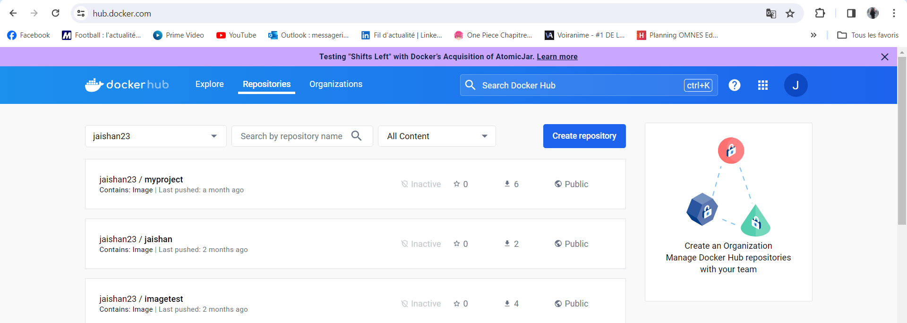

# Partie 5 : Orchestration de Conteneurs avec Docker Compose

## Configuration de Docker Compose

- **Créer un fichier docker-compose.yml** : 
  Un fichier `docker-compose.yml` est fourni à la racine du projet pour définir et exécuter l'ensemble des services de l'application dans des conteneurs Docker.

## Démarrage de l'Application avec Docker Compose

- **Utiliser Docker Compose pour démarrer l'application** : 
  Lancer l'application en exécutant le service défini dans le `docker-compose.yml`.
```bash
docker-compose up
```

- **Arrêter et retirer les conteneurs** : 
Stopper et supprimer tous les conteneurs créés par le `docker-compose.yml`.
```bash
docker-compose down
```

## Avantages de l'Utilisation de Docker Compose

- Simplifier le démarrage de l'application avec toutes ses dépendances en une seule commande.
- Assurer la cohérence des environnements de développement, de test et de production.

## Captures d'écran
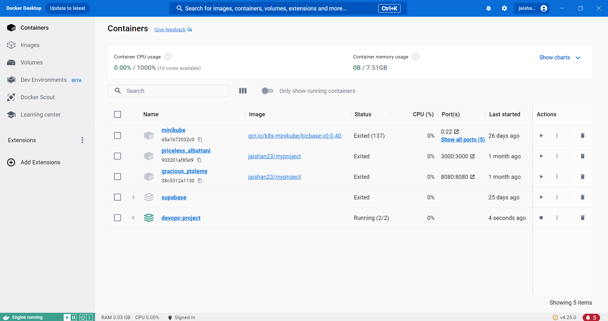

# Partie 6 : Orchestration Docker avec Kubernetes

L'orchestration avec Kubernetes sert à automatiser la gestion des applications conteneurisées, offrant ainsi une mise à l'échelle, une gestion du trafic, une découverte de service, et une automatisation du déploiement efficaces.

## Configuration de Kubernetes avec Minikube

- **Démarrer Minikube** :
  Créer un cluster Kubernetes local simulant un environnement de production.
  ```bash
  minikube start
  ```

- **Vérifier le statut de Minikube** :
Confirmer l'activation du cluster et sa disponibilité pour le déploiement.
  ```bash
  minikube status
  ```

## Création des Manifestes Kubernetes

- **Appliquer les déploiements (deployment.yaml)** :
Automatiser le déploiement et la mise à l'échelle des conteneurs d'applications.

  ```bash
  kubectl apply -f deployment.yaml
  ```

  - **Appliquer les services (services.yaml)** :
Exposer les conteneurs d'applications à l'aide de points d'accès réseau configurables.
  ```bash
  kubectl apply -f services.yaml
  ```

  - **Appliquer les volumes persistants (redis-pv-pvc.yaml)** :
Mettre en œuvre un stockage durable pour les données importantes devant survivre aux redémarrages des conteneurs.
  ```bash
  kubectl apply -f redis-pv-pvc.yaml
  ```

  ## Lancement de l'Application avec Kubernetes

- **Déployer l'application** :
Lancer l'application en utilisant les configurations déclaratives fournies dans les fichiers YAML.
  ```bash
  kubectl apply -f k8s/
  ```

- **Contrôler l'état des pods** :
Inspecter l'état des pods pour vérifier le bon déploiement de l'application.
  ```bash
  kubectl get pods
  ```

- **Accéder à l'application via le service Minikube** :
Ouvrir l'application dans un navigateur en utilisant l'URL fournie par Minikube.
  ```bash
  minikube service <nom-du-service>
  ```

## Nettoyage des Ressources Kubernetes
- **Retirer les ressources déployées**:
Libérer les ressources du cluster en supprimant les objets définis dans les fichiers YAML.
  ```bash
  kubectl delete -f k8s/
  ```

## Captures d'écran
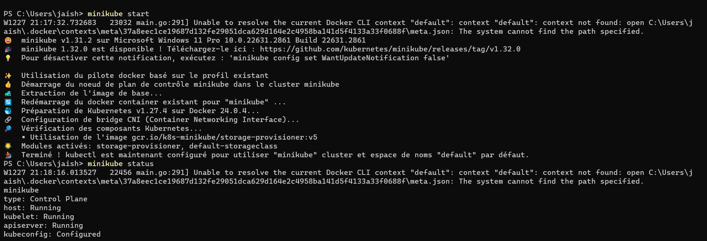
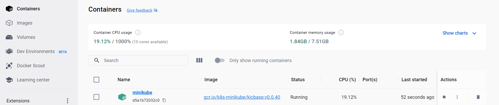


# Partie 7 : Service Mesh avec Istio

L'utilisation d'Istio offre une gestion avancée du trafic, des métriques, des politiques de sécurité et une visibilité accrue sur l'infrastructure microservices dans Kubernetes.

## Déploiement avec Istio

- **Installer Istio dans le cluster Kubernetes** :
  Intégrer Istio dans le cluster pour exploiter les capacités du maillage de services.
  ```bash
  istioctl install --set profile=demo -y
  ```

- **Labeliser le namespace pour l'injection automatique d'Istio** :
Préparer le namespace default pour l'injection automatique des sidecars Istio.
```bash
kubectl label namespace default istio-injection=enabled
```

## Configuration du Routage de Trafic

- **Déployer les configurations Istio** :
Mettre en place le routage du trafic entre différentes versions de l'application en appliquant les configurations Istio.
```bash
kubectl apply -f istio/istio-destinationrule.yaml
kubectl apply -f istio/istio-virtualservice.yaml
kubectl apply -f istio/istio-gateway.yaml
```

## Observation avec Kiali

- **Déployer Kiali dans le cluster** :
Installer Kiali pour visualiser et contrôler le service mesh Istio.

```bash
kubectl apply -f istio/addons/kiali.yaml
```

- **Accéder au tableau de bord Kiali** :
Examiner le maillage de services et surveiller le trafic entre les services via le tableau de bord Kiali.
```bash
istioctl dashboard kiali
```

## Nettoyage des Ressources

- **Retirer les configurations Istio et les ressources** :
Éliminer les configurations Istio et les ressources associées du cluster une fois les opérations terminées.

```bash
kubectl delete -f istio/
```

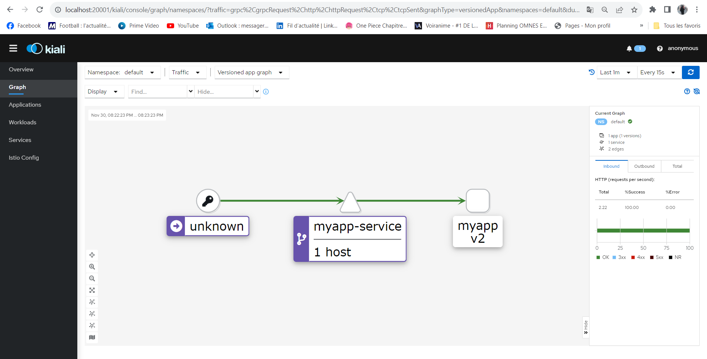
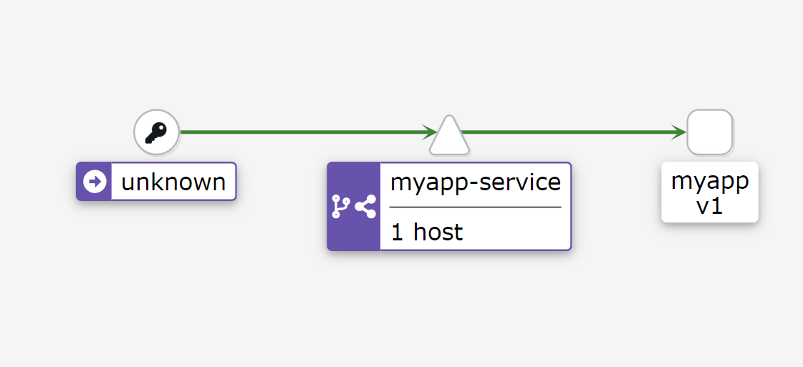
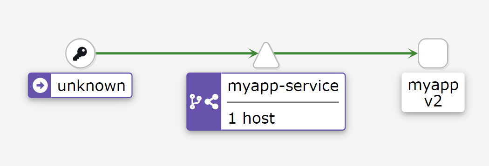
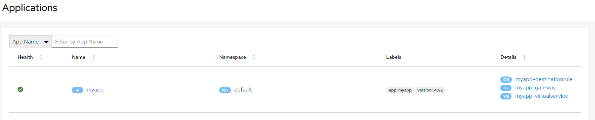
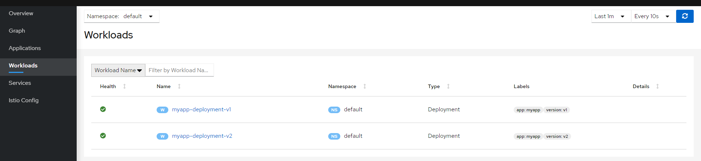
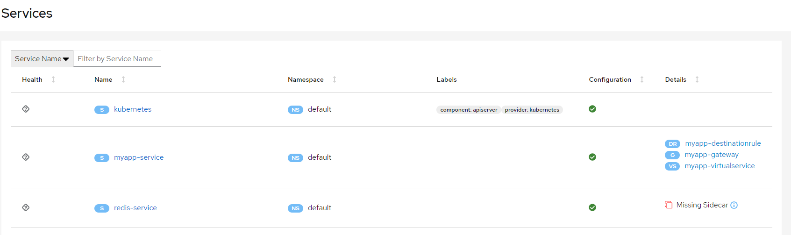
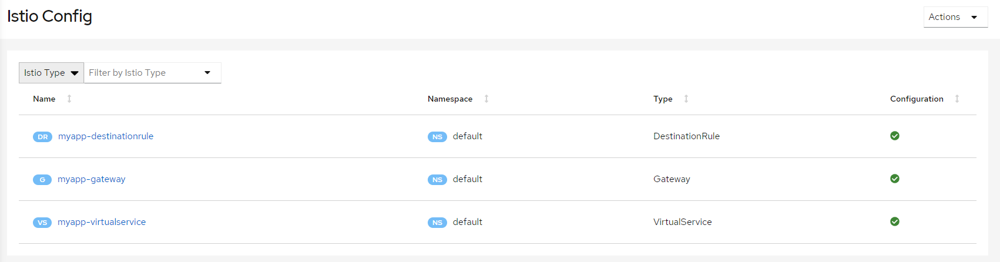
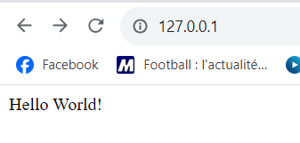
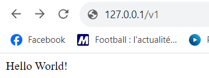
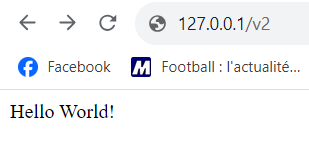

# Partie 8 : Monitoring avec Prometheus et Grafana

## Surveillance avec Prometheus

Prometheus est utilisé pour collecter des métriques et des alertes en temps réel. Il fournit un puissant langage de requête pour lire et analyser ces métriques.

### Commandes pour l'installation et la vérification de Prometheus

- **Installer Prometheus dans le cluster Istio** :
  ```bash
  kubectl apply -f istio/addons/prometheus.yaml
  ```

- **Port-forwarding pour accéder à l'interface de Prometheus** :
  ```bash
  kubectl port-forward svc/prometheus 9090:9090 -n istio-system
  ```

  ### Interprétation des graphiques Prometheus

- **istio_requests_total** : Ce graphique montre le nombre total de requêtes traitées par Istio, ce qui peut aider à identifier les pics de trafic ou les anomalies.
- **up** : Cette simple requête indique l'état des services surveillés, où 1 signifie opérationnel et 0 signifie en panne.

## Visualisation avec Grafana

Pour mettre en place la surveillance de l’application conteneurisée avec Grafana, voici les étapes à suivre :

### 1. Configurer Grafana :
- Déployer Grafana sur le cluster Kubernetes en appliquant le fichier de configuration grafana.yaml :
  ```bash
  kubectl apply -f addons/grafana.yaml -n istio-system
  ```

  ### 2. Accéder à Grafana :
- Rediriger le trafic du port local vers le service Grafana en utilisant le port-forwarding :
  ```bash
  kubectl port-forward svc/grafana 3000:3000 -n istio-system
  ```
- L'interface de Grafana est maintenant accessible via [http://127.0.0.1:3000](http://127.0.0.1:3000).

### 3. Configurer des tableaux de bord :
- Se connecter à Grafana et lier le serveur Prometheus en tant que source de données pour visualiser les métriques collectées.
- Créer et personnaliser des tableaux de bord pour afficher les métriques pertinentes de l'application.

### 4. Créer des alertes :
- Configurer des alertes pour surveiller des conditions spécifiques telles que l'utilisation de la mémoire ou la disponibilité de l'application.
- Utiliser la fonctionnalité d'alerting de Grafana pour définir les seuils et les conditions qui déclencheront les alertes.

### 5. Gérer et répondre aux alertes :
- Examiner et ajuster les alertes dans la section 'Alerting' de Grafana.
- Réagir aux alertes Pending ou Firing en investiguant et en résolvant les problèmes indiqués.

## Description des alertes :

### 1. Alerte "High Memory Usage" (Utilisation élevée de la mémoire) :
- **Objectif** : Cette alerte surveille l'utilisation de la mémoire de votre application conteneurisée.
- **Configuration** : Vous avez défini un seuil supérieur d'utilisation de la mémoire au-delà duquel l'alerte doit être déclenchée.
- **Comportement** : Lorsque l'utilisation de la mémoire de l'application dépasse le seuil défini, Grafana déclenche cette alerte.
- **Action** : Une notification est envoyée aux canaux définis (par exemple, e-mail, Slack) pour informer les administrateurs du dépassement de l'utilisation de la mémoire.
- **Résolution** : Les administrateurs peuvent réagir rapidement en examinant les métriques de l'application, en identifiant la source de l'utilisation excessive de la mémoire et en prenant des mesures pour résoudre le problème, comme le redimensionnement des ressources allouées au conteneur.

### 2. Alerte "Application Down" (Application hors service) :
- **Objectif** : Cette alerte surveille l'état de disponibilité de votre application.
- **Configuration** : Vous avez défini un seuil de non-disponibilité au-delà duquel l'alerte doit être déclenchée.
- **Comportement** : Lorsque l'application devient non disponible, par exemple en raison d'une panne ou d'une erreur majeure, Grafana déclenche cette alerte.
- **Action** : Une notification est envoyée aux canaux définis pour alerter les administrateurs de l'indisponibilité de l'application.
- **Résolution** : Les administrateurs peuvent intervenir immédiatement pour enquêter sur la cause de l'indisponibilité de l'application, effectuer des diagnostics et prendre des mesures correctives, telles que le redémarrage de l'application ou la correction des erreurs.

Ces deux alertes contribuent à maintenir la disponibilité et la performance de votre application en identifiant les problèmes potentiels de manière proactive. En cas de déclenchement de ces alertes, elles permettent une réaction rapide pour minimiser les perturbations et garantir une expérience utilisateur optimale.

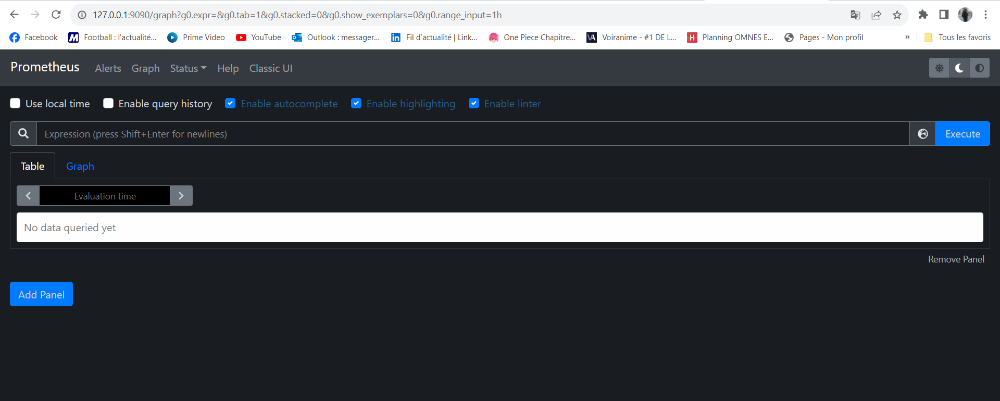
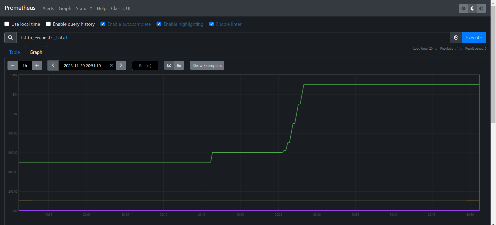
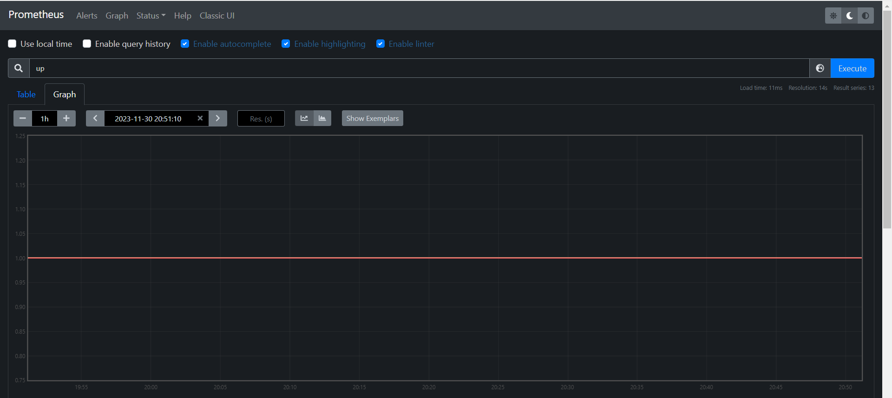
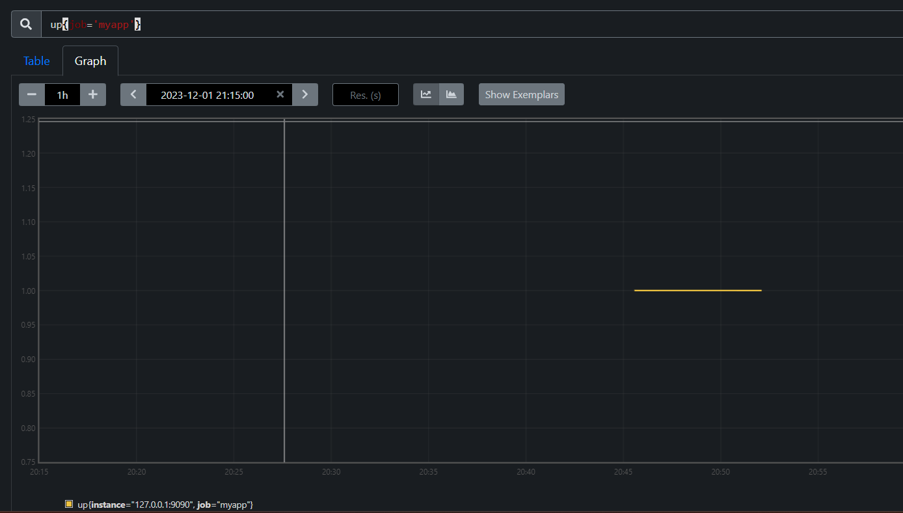
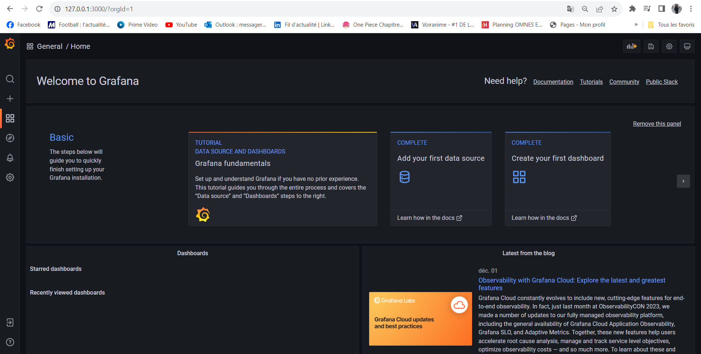
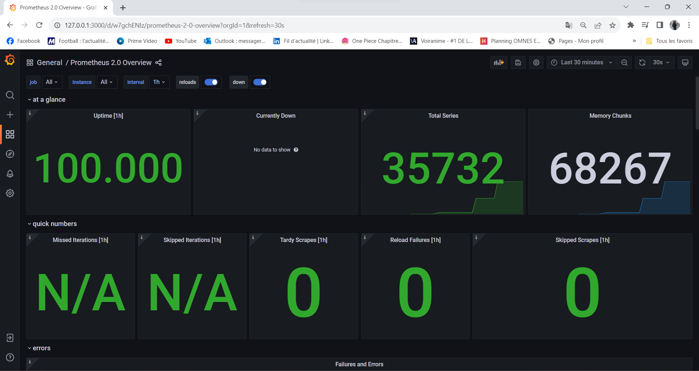
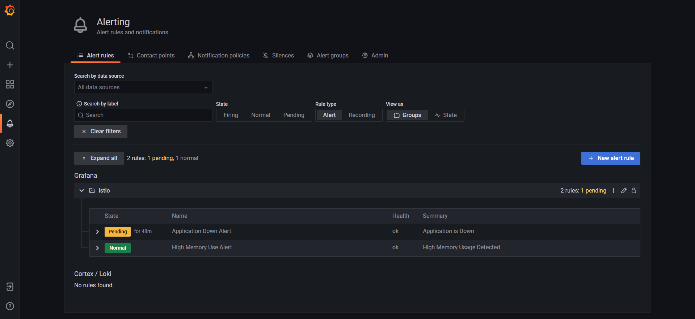
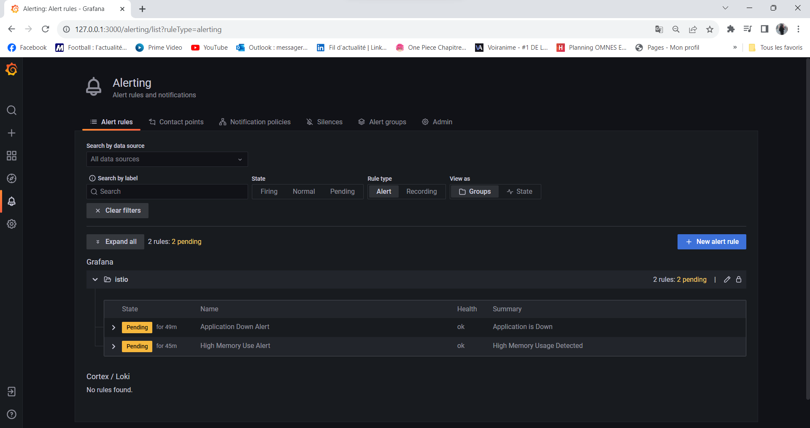
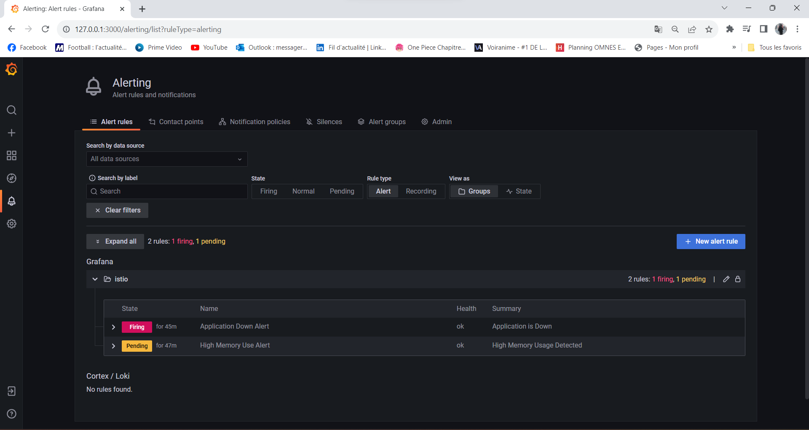
